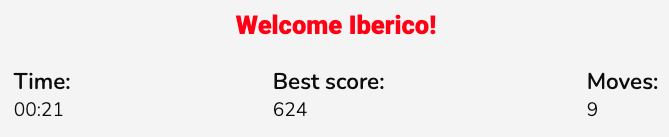

# **Iberico's Memory Game - Portfolio Project 2**

Dive into Iberico's Memory Game, a card game challenge inspired by the previous [Portfolio Project 1 - Iberico Alex Photography](https://github.com/ibericoalex/iberico-alex-photography/tree/main). Consider this an engaging extension that complements the original [PP1 website](https://ibericoalex.github.io/iberico-alex-photography/).

In this game, players match cards while racing against time and moves to secure top scores.

**Aim of the project?** To craft a responsive front-end site that adjusts based on user actions, ensuring a tailored experience that aligns with the player's objectives.

Live deployment link can be found [here](https://ibericoalex.github.io/ibericos-memory-game/).

## **Table of Contents**

1. [User Stories](#user-stories "User Stories")
2. [Design](#design "Design")
   - [Colour](#colour "Colour")
   - [Fonts](#fonts "Fonts")
   - [Wireframes](#wireframes "Wireframes")
3. [Features](#features "Features")
   - [Starting Modal](#starting-modal "Starting Modal")    
   - [Logo](#Logo "Logo")
   - [Music Player](#Music-Player "Music Player")
   - [Favicon](#Favicon "Favicon")
   - [Game Description](#Game-Description "Game Description")
   - [Game Metrics](#Game_metrics "Game metrics")
   - [Memory Card Game](#Memory-Card-Game "Memory Card Game")
   - [Endgame Modal](#Endgame-Modal "Endgame Modal")
   - [404 error message page](#404-error-message-page "404 error message page")
4. [Technologies, Languages & Programs Used](#technologies-languages--programs-used)
5. [Testing](#testing "Testing")
6. [Deployment](#deployment "Deployment")
    - [Local Deployment](#local-deployment "Local Deployment")
7. [Credits](#credits "Credits")
    - [Code](#code "Code")
    - [Content](#content "Content")
    - [Design](#design "Design")
    - [Media](#media "Media")
8. [Acknowledgements](#Acknowledgements "Acknowledgements")

## **User Stories**

- As a **user**, I want **to have the website's name clearly presented at the header** so that **I can immediately recognize its purpose and theme**.

- As a **user**, I want **to have the option to switch the game's music on and off** so that **I can customize my gaming experience**.

- As a **user**, I want **to access clear instructions at the beginning of the game** so that **I can understand and play the game properly**.

- As a **user**, I want **to enter my name into the game** so that **my gameplay feels more personalized and tailored to me**.

- As a **user**, I want **to visibly observe the game's ongoing metrics like time and current moves** so that **I can track my performance in real-time**.

- As a **user**, I want **to view the highest score achieved** so that **I can challenge myself to beat it**.

- As a **user**, I want **to see my scores and receive a congratulatory message after completing the game** so that **I can feel recognized and inspired to play again**.

- As a **user**, I want **to encounter a 404 error page when I unintentionally land on a wrong link** so that **I can be guided back to the main page seamlessly**.

## **Design**
For this project, I drew inspiration from the previous [PP1](https://ibericoalex.github.io/iberico-alex-photography/) project to ensure consistency. The website features a bold, minimalist, and sleek design that perfectly aligns with my artistic vision and work.

All the images presented in the project are exclusively captured and owned by me.

### **Colour**
I used the same color code - bold colors like red, black, and white to represent my artistic brand. These colors not only enhance the visual appeal but also ensure easy readability for users. To generate the color scheme, I utilized [Coolors.co](https://coolors.co/ff0000-0d0d0d-fafafa-525252).

### **Fonts**
I retained the fonts from the previous project. I incorporated fonts from [Google Fonts](https://fonts.google.com/) into my website. For the main headers and logo, I selected the font **Roboto**, while for the body text, I opted for **Nunito**. These font choices add a stylish and cohesive touch to the overall design.

### **Wireframes**
Before proceeding with the HTML, CSS or JavaScript coding, I made use of Balsamiq to create the wireframes for my memory card game. This step allowed me to envision and solidify the desired visual structure of the changes I intended to implement from my previous project. By establishing a clear blueprint through a wireframe, I could confidently proceed with the development process.

- Index - Memory Game Page

- Modal

## **Features**

### Starting Modal

Players can enter their name, offering a gameplay experience that's personalized and tailored to them.
Additionally, this section provides instructions on "How to Play".

### Logo

The logo, prominently displayed at the top, reveals the game's purpose and theme to the user.

### Music Player

Located at the top right is a play button, granting users the option to enjoy music during their game. To halt the music, simply hit the pause button. This feature enhances the game with an auditory dimension, immersing the player further.

### Favicon

The favicon displayed on the browser tab encapsulates the branding of Iberico Alex Photography, providing a small yet impactful visual representation of the website's identity.

### Game Description

The Game Description offers a brief insight into Iberico Alex's artistry while introducing the memory card game. Note: Instructions on "How to Play" were already presented in the initial modal.

### Game metrics

This section lets you monitor the elapsed time and the number of moves made, offering real-time performance insights. Additionally, it displays your top scores from previous games..

### Memory Card Game

Iberico's Memory Game features a total of 12 cards, randomly arranged within the grid. The goal is to match each card pair using the fewest moves and in the shortest time. Cards initially face downwards, but when tapped, they disclose a captivating photo from Iberico Alex's portfolio.

### Endgame Modal

Upon successfully matching all card pairs, a congratulatory pop-up emerges, presenting your current score and contrasting it with your previous best if you've played earlier. A CTA (call-to-action) button reading "Play again!" beckons you to take another shot and aim for a better score.

### 404 error message page

A tailored 404 error page is in place for users who may stray via a faulty link. Mirroring the primary site's design, this page presents a CTA button to redirect users back to the intended content.

## **Technologies, Languages & Programs Used**

* [HTML](https://www.w3schools.com/html/): Markup language for creating web pages.
* [CSS](https://www.w3schools.com/CSS/): Stylesheet language for styling the appearance of web pages.
* [JavaScript](https://www.w3schools.com/js/): Programming language that is one of the core technologies of the World Wide Web, alongside HTML and CSS
* [GitHub](https://github.com/): Web-based platform for version control and collaboration on software projects.
* [GitHub Pages](https://pages.github.com/): Hosting service provided by GitHub for publishing static web pages.
* [Google Fonts](https://fonts.google.com/): Library of free and open-source web fonts.
* [Google Lighthouse](https://developer.chrome.com/docs/lighthouse/overview/): Automated tool for auditing and improving web page quality.
* [W3C Validator](https://validator.w3.org/): Tool for checking HTML and CSS code compliance with web standards.
* [CodeAnywhere](https://codeanywhere.com/): Cloud-based integrated development environment (IDE) for coding, collaborating, and deploying projects.
* [VSCode](https://code.visualstudio.com/): Free and highly extensible source code editor with built-in features for editing, debugging, and version control integration. It supports various programming languages and is available for multiple platforms.
* [ChatGPT](https://chat.openai.com/): Artificial intelligence chatbot.
* [Balsamiq Wireframes](https://balsamiq.com/wireframes/): Rapid low-fidelity UI wireframing tool.
* [Techsini](http://techsini.com/multi-mockup/index.php): Mockup generator.

## **Testing**

Testing available [here](./TESTING.md)

## **Deployment**

The procedure for deployment followed the "Creating your site" steps provided in GitHub Docs:
- Log into Github.
- Select desired GitHub Repository to be deployed live.
- Underneath the repository name, click the “Settings” option.
- In the sub-section list on the left, under “Code and automation”, click “Pages”.
- Within the ”Source” section choose ”main” as Branch and root as folder and click ”Save”.
- The page refreshes and a website shall then deploy via a link.
- The following is the live link deployed: https://ibericoalex.github.io/ibericos-memory-game/ 

### **Local Deployment**

This repository can be cloned and run locally with the following steps:
- Login to GitHub.
- Select repository named: ibericoalex/iberico-alex-photography
- Click code toggle button and copy the url (i.e., https://github.com/ibericoalex/ibericos-memory-game).
- In your IDE, open the terminal and run the git clone command (i.e., git clone https://ibericoalex.github.io/ibericos-memory-game). The repository will now be cloned in your workspace.

## **Credits**
### **Code**
- Memory game card code - inspired by following [youtube video](https://www.youtube.com/watch?v=ZniVgo8U7ek&t=139s).
- Modal code - inspired by Kevin Powell's [youtube video](https://www.youtube.com/watch?v=TAB_v6yBXIE&ab_channel=KevinPowell).
- Timer section code - inspired by following [website](https://daily-dev-tips.com/posts/vanilla-javascript-timer/). 
- Score calculation code - produced with the help of my Mentor Akshat Garg.
- Toggle music ON/OFF code - inspired by following [website](https://stackoverflow.com/questions/27368778/how-to-toggle-audio-play-pause-with-one-button-or-link).

### **Content**
- I personally wrote all the content on the website. The content was then refined and corrected with the help of ChatGPT, including the README file.

### **Design**
- Wireframes were created using [Balsamiq](https://balsamiq.com/)
- The color scheme was carefully validated for readability using [Webaim](https://webaim.org/resources/contrastchecker/)

### **Media**
- The favicon was designed and created by me using Adobe Photoshop.
- All the photos displayed on the website were captured by me.

## **Acknowledgements**
A special acknowledgment to my mentor, Akshat Garg, for his instrumental guidance as I navigated this project within a mere 2 to 3 days. His promptness and availability played a pivotal role, and I am profoundly thankful for it.