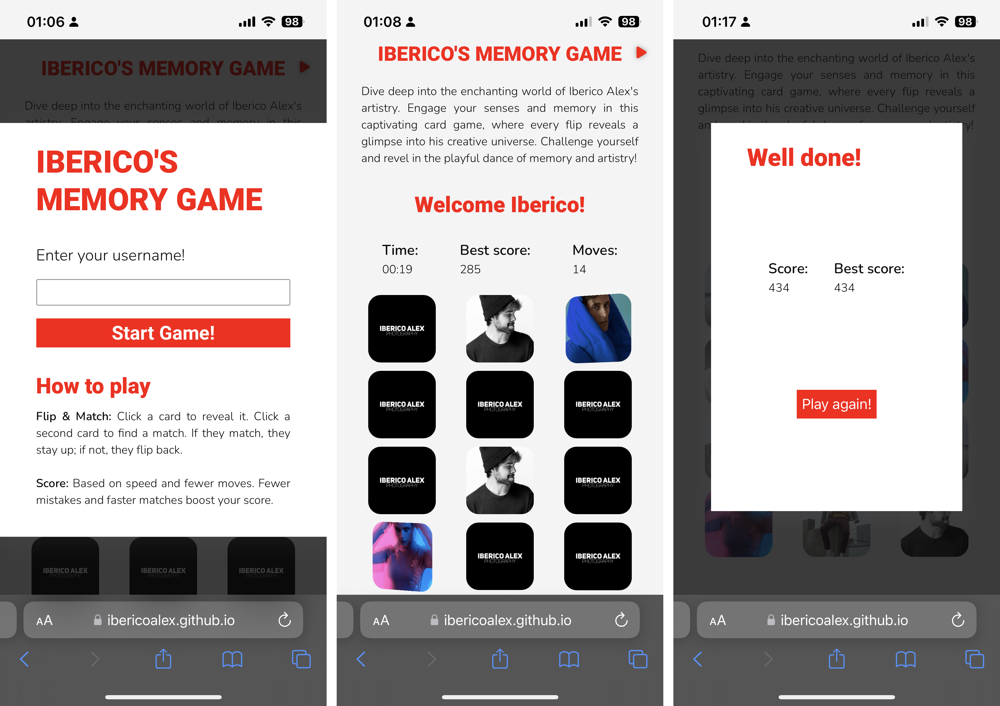
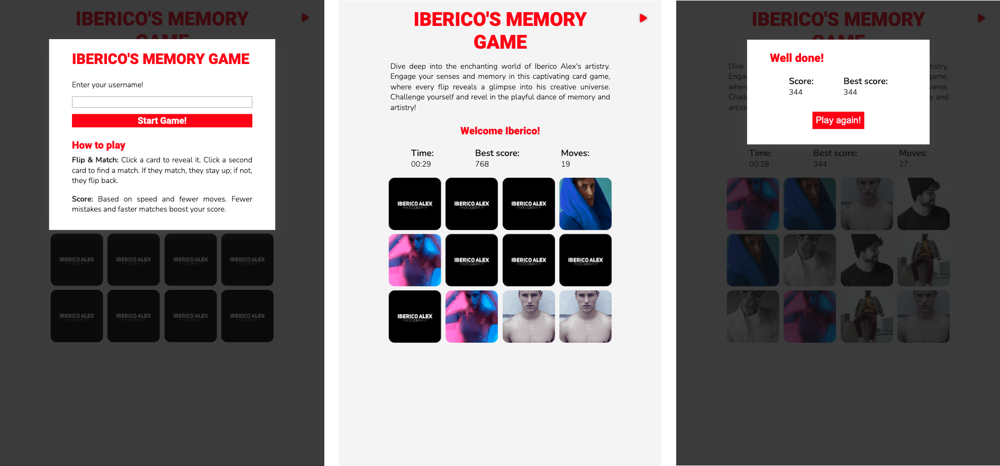
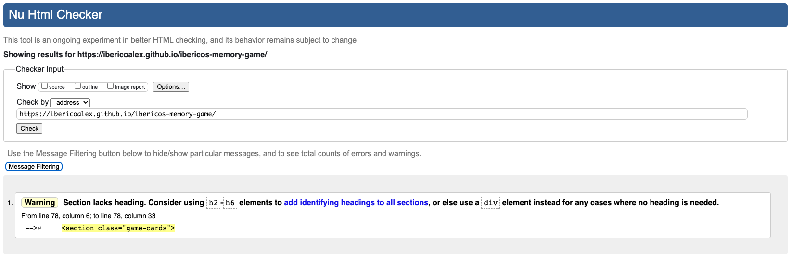
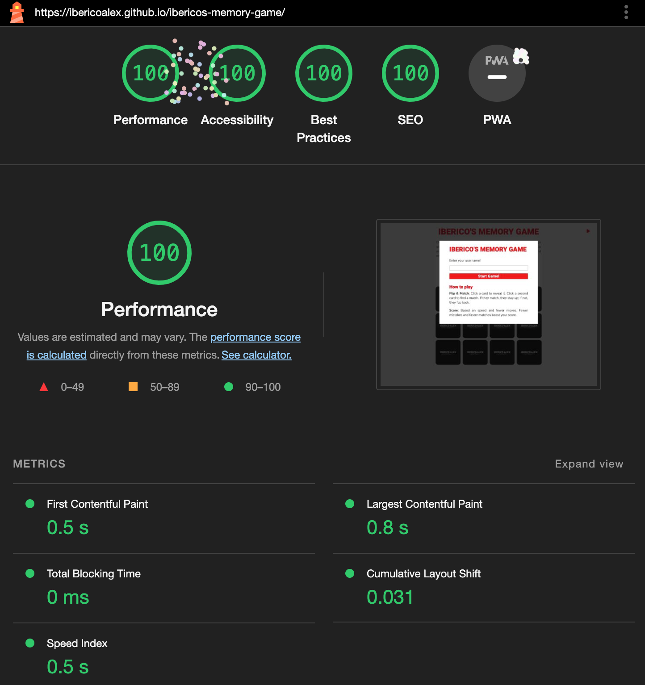
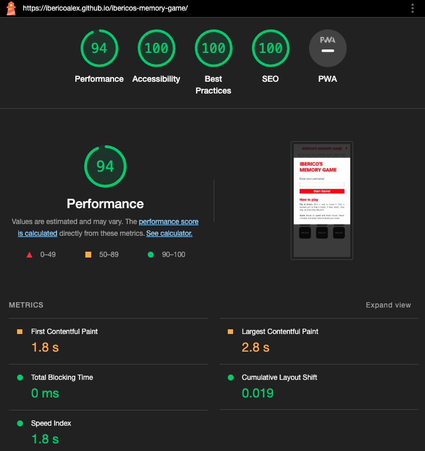

## **Table of Contents**

1. [Testing](#testing "Testing")
   - [User Testing](#user-testing "User Testing")
   - [Manual Testing](#manual-testing "Manual Testing")
   - [Cross-browser Testing](#cross-browser-testing "Cross-browser Testing")
   - [Compatibility and Responsiveness Testing](#compatibility-and-responsiveness-testing "Compatibility and Responsiveness Testing")
2. [Bugs](#bugs "Bugs")
3. [Validator Testing](#validator-testing "Validator Testing")
   - [HTML Validator](#html-validator "HTML Validator")    
   - [CSS Validator](#css-validator "CSS Validator")
   - [JSHint JavaScript Validator](#jshint-javascript-validator "JSHint JavaScript Validator")
   - [Performance Testing](#performance-testing "Performance Testing")

    
## **Testing**

### **User Testing**
After deploying the site, I shared the link with my family and friends for testing purposes, and I received positive feedback from everyone. They found the site and game easy to use, and it displayed beautifully on all of their devices without any issues.

### **Manual Testing**
Thorough manual testing was conducted during the project's development, aligning with the User Stories. The final results of the testing are provided below.

- As a **user**, I want **to have the website's name clearly presented at the header** so that **I can immediately recognize its purpose and theme**.

| **Test** | Issue | Result |
| -------- | ----- | ------ |
| 1        | The header instantly reveals the website's purpose and theme. | PASS   |

- As a **user**, I want **to have the option to switch the game's music on and off** so that **I can customize my gaming experience**.

| **Test** | Issue | Result |
| -------- | ----- | ------ |
| 2        | The game provides an easily accessible option for users to toggle the music on and off, enhancing user experience. | PASS   |

- As a **user**, I want **to access clear instructions at the beginning of the game** so that **I can understand and play the game properly**.

| **Test** | Issue | Result |
| -------- | ----- | ------ |
| 3        | Clear and concise instructions are available at the game's start, ensuring players can understand and play the game effectively. | PASS   |

- As a **user**, I want **to enter my name into the game** so that **my gameplay feels more personalized and tailored to me**.

| **Test** | Issue | Result |
| -------- | ----- | ------ |
| 4        | The game has a feature where players can input their name for a more tailored gaming experience. | PASS   |

- As a **user**, I want **to visibly observe the game's ongoing metrics like time and current moves** so that **I can track my performance in real-time**.

| **Test** | Issue | Result |
| -------- | ----- | ------ |
| 5        | The game offers real-time metrics including time and moves, allowing players to monitor their performance. | PASS   |

- As a **user**, I want **to view the highest score achieved** so that **I can challenge myself to beat it**.

| **Test** | Issue | Result |
| -------- | ----- | ------ |
| 6        | The game displays the highest score, giving players a benchmark to aim for in their gameplay. | PASS   |

- As a **user**, I want **to see my scores and receive a congratulatory message after completing the game** so that **I can feel recognized and inspired to play again**.

| **Test** | Issue | Result |
| -------- | ----- | ------ |
| 7        | Upon game completion, users can view their scores and receive a congratulatory message, enhancing player engagement. | PASS   |

- As a **user**, I want **to encounter a 404 error page when I unintentionally land on a wrong link** so that **I can be guided back to the main page seamlessly**.

| **Test** | Issue | Result |
| -------- | ----- | ------ |
| 8        | The game's platform incorporates a user-friendly 404 error page, guiding users back to the main page if they access a non-existent link. | PASS   |

### **Cross-browser Testing**

After publishing the site on GitHub Pages, I tested it on multiple browsers: Chrome, Firefox, and Edge. I'm pleased to report that the site loaded flawlessly on all browsers without any issues or discrepancies.

### **Compatibility and Responsiveness Testing**
I personally tested the site on my iPhone 13 Pro and utilized DevTools to ensure responsiveness across various screen sizes. The site performed seamlessly on all devices, and the content adjusted flawlessly as intended for each screen size.

- iPhone Pro 13
 

 

- iPad Air

## **Bugs**
During the website development process, no significant bugs were encountered. However, one minor issue was identified:

1. **End Modal on Smaller Screen Size**: The modal display is not optimized for smaller width screens. Given more time, I would delve deeper and refine the media queries for this size.

## **Validator Testing**

### **HTML Validator**

The [W3C Markup Validation Service](https://validator.w3.org/) for the HTML code was passed in as a URL and returned follwiing message: "Warning: Section lacks heading. Consider using h2-h6 elements to add identifying headings to all sections, or else use a div element instead for any cases where no heading is needed."

   **=> After consultation with my mentor, I was advised to not take action regarding the comment and use sections instead of divs, as it's the best practice in this context.**
 
- [Index Page](https://validator.w3.org/nu/?doc=https%3A%2F%2Fibericoalex.github.io%2Fibericos-memory-game%2F)

### **CSS Validator**

No errors were returned through the official [W3C CSS Validation Service](https://jigsaw.w3.org/css-validator/).

### **JSHint JavaScript Validator**

Using the official [JSHint-JavaScript-Validator](https://jshint.com/), 42 warnings were identified. However, my mentor advised me to ignore these warnings since they are not pertinent to our context.

The code flags an unused variable on line 41 of the JS file, referring to openModal. This function is invoked directly from the HTML when the "Start Game!" button on the initial modal is pressed.

### **Performance Testing**

The website underwent performance testing using the Lighthouse feature in Google Chrome's Developer Tools. The results can be found below. I am very pleased with the results.

- Desktop performance testing

- Mobile performance testing

